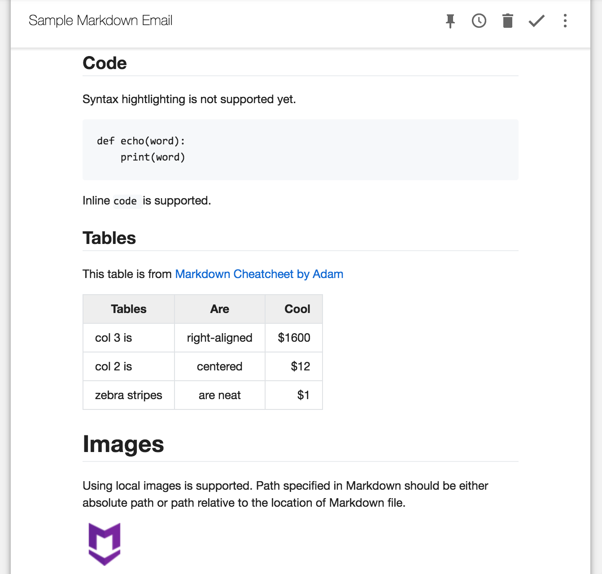

Mdmail: Send emails written in Markdown
=======================================

[](https://travis-ci.org/yejianye/mdmail)
[](https://coveralls.io/github/yejianye/mdmail)

Mdmail sends emails written in Markdown. It could be used as a standalone command-line script or as a python module. The features includes

- Have a sane default CSS style and support CSS customization
- Support local images as inline images

Screenshot of an email sent via mdmail viewed in Google Inbox



To install mdmail

```bash
$ pip install mdmail
```

Send Email in Command-line
--------------------------

When sending emails from command-line, the body of the email could be read from a file or stdin.

Email headers such as subject, from/to, cc etc could be specified at the beginning of the markdown file, Or be specified in command-line arguments.

Here is an example of Markdown file with email headers

```
Subject: Sample Email
From: foo@xyz.com
To: bar@xyz.com
Cc: baz@xyz.com

# Sample Email

-


```

To send this email with mdmail

```bash
$ mdmail sample_email.md
```

Here is an example of specifying subject, from/to in command-line

```bash
$ mdmail --from=foo@xyz.com --to=bar@xyz.com --subject='Sample' sample_email.md
```

To read email content from stdin, 

```bash
$ echo '# Sample Email' | mdmail --from=foo@xyz.com --to=bar@xyz.com --subject='Sample'
```

SMTP server configurations are read from the following environment variables

```bash
export MDMAIL_HOST="" # default: localhost
export MDMAIL_PORT="" # default: 25
export MDMAIL_USE_TLS="" # default: false
export MDMAIL_USE_SSL="" # default: false
export MDMAIL_USERNAME="" # default: None
export MDMAIL_PASSWORD="" # default: None
export MDMAIL_DEFAULT_SENDER="" # default: None
```

Full help of `mdmail` command-line script

```bash
usage: mdmail [-h] [--subject SUBJECT] [--from FROM_] [--to TO] [--cc CC]
              [--bcc BCC] [--reply-to REPLY_TO] [--css CSS] [--print-only]
              [file]

Send email written in Markdown.

positional arguments:
  file                  Markdown file for email content. Default to STDIN.

optional arguments:
  -h, --help            show this help message and exit
  --subject SUBJECT, -s SUBJECT
                        Subject line
  --from FROM, -f FROM
                        From address
  --to TO, -t TO        To addresses, separated by comma
  --cc CC, -c CC        CC address, separated by comma
  --bcc BCC, -b BCC     Bcc address, separated by comma
  --reply-to REPLY_TO, -r REPLY_TO
                        Reply-to address
  --css CSS             Use a custom CSS file
  --print-only, -p      Only print out rendered html
```

Send Email in Python Code
--------------------------

Sending emails in python is straight-forward.

```python
import mdmail

email="""
# Sample Email

- Python is awesome
- Markdown is cool


"""

mdmail.send(email, subject='Sample Email',
            from_email='foo@example.com', to_email='bar@example.com')
```
            
By default, it will use SMTP server on localhost. You could specify a SMTP server as well.

```
# Specify SMTP server
smtp = {
  'host: 'my-mailserver.com',
  'port': 25,
  'tls': False,
  'ssl': False,
  'user: '',
  'password': '',
}

mdmail.send(content, subject='Sample Email',
            from_email='foo@example.com', to_email='bar@example.com',
            smtp=smtp)
```


### API documentation `mdmail.send` 

- **email** (str/obj): A markdown string or EmailContent object 
- **subject** (str): subject line
- **from_email** (str): sender email address
- **to_email** (str/list): recipient email addresses
- **cc** (str/list): CC email addresses (string or a list)
- **bcc** (str/list): BCC email addresses (string or a list)
- **reply_to** (str): Reply-to email address
- **smtp** (dict): SMTP configuration with following keys
    - *host* (str): SMTP server host. Default: localhost
    - *port* (int): SMTP server port. Default: 25
    - *tls* (bool): Use TLS. Default: False
    - *ssl* (bool): Use SSL. Default: False
    - *user* (bool): SMTP login user. Default empty
    - *password* (bool): SMTP login password. Default empty

Use mdmail with Vim and Emacs
-------------------------------

Since `mdmail` can read from stdin and support email headers such as subject/from/to in the markdown file itself, integrating mdmail with Vim, Emacs or other text editors is easy.

To use mdmail in Vim, just write a markdown email with headers, and then execute `w !mdmail` command, which will send current buffer as stdin to mdmail.

In Emacs, you could write a small function to do the same thing

```lisp
(defun mdmail-send-buffer ()
  (interactive)
  (shell-command-on-region (point-min) (point-max) "mdmail"))
```

Then `M-x mdmail-send-buffer` will send current buffer to mdmail.
